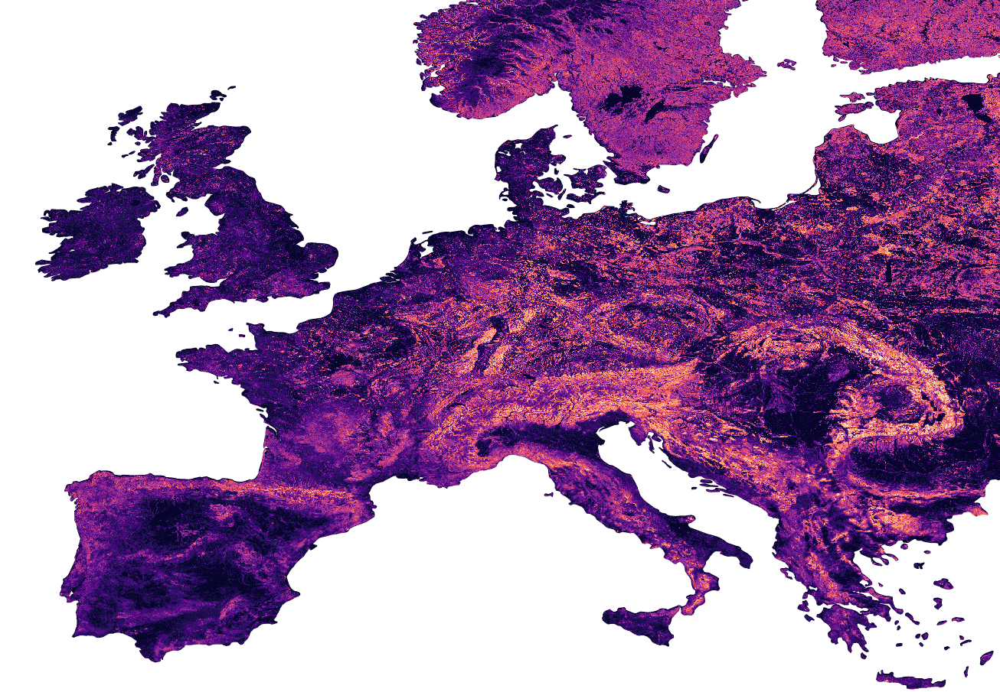
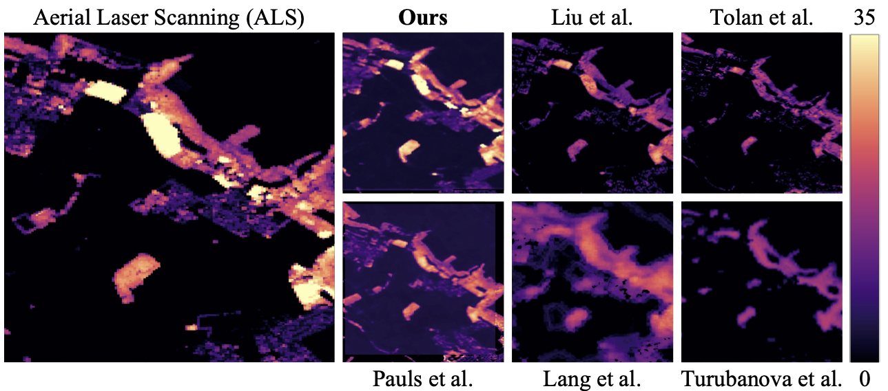
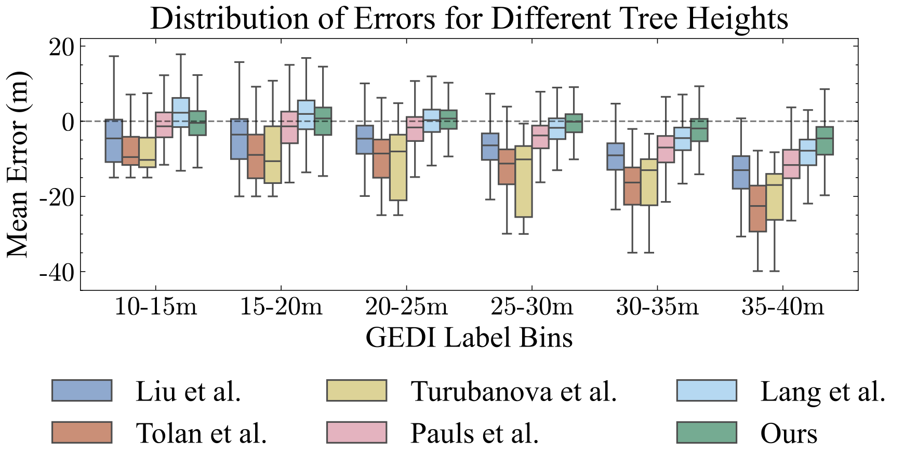

# Europe-Temporal-Canopy-Height
[Jan Pauls](https://www.wi.uni-muenster.de/de/institut/dasc/personen/jan-pauls), [Max Zimmer](https://maxzimmer.org) , [Berkant Turan](https://b-turan.github.io), [Sassan Saatchi](https://science.jpl.nasa.gov/people/Saatchi/), [Philippe Ciais](https://www.lsce.ipsl.fr/Phocea/Pisp/index.php?nom=philippe.ciais), [Sebastian Pokutta](https://pokutta.com), [Fabian Gieseke](https://www.wi.uni-muenster.de/department/dasc/people/fabian-gieseke)


[[`Paper`](https://arxiv.org/abs/2501.19328)] [[`Blogpost`](https://maxzimmer.org/blog/2025/capturing-temporal-dynamics-in-tree-canopy-height/)]  [`Google Earth Engine viewer`](https://europetreemap.projects.earthengine.app/view/europeheight)] [[`BibTeX`](#citing-the-paper)]



We present a novel approach to generate large-scale, high-resolution canopy height maps over time. Our model accurately predicts canopy height over multiple years given Sentinel-1 composite and Sentinel-22 time series satellite data. Using GEDI LiDAR data as the ground truth for training the model, we present the first 10m resolution temporal canopy height map of the European continent for the period 2019-2022. As part of this product, we also offer a detailed canopy height map for 2020, providing more precise estimates than previous studies. Our pipeline and the resulting temporal height map are publicly available, enabling comprehensive large-scale monitoring of forests and, hence, facilitating future research and ecological analyses.



A comparison between our map and other existing global (Tolan et al., Pauls et al., Lang et al.) and europe (Liu et al., Turubanova et al.) height maps shows that the accuracy on big trees is improved and underestimation is reduced by up to 50%. Even when comparing to ALS data, our map is only one detecting patches of especially big trees.



## Interactive Google Earth Engine viewer
We uploaded our produced canopy height map to Google Earth Engine and created a [GEE app](https://europetreemap.projects.earthengine.app/view/europeheight) that allows users to visualize our map and compare it to other existing products. If you want to build your own app or download/use our map in another way, you can access the map under the following asset_id:

```
var canopy_height_2019 = ee.ImageCollection('projects/worldwidemap/assets/europe_2019').mosaic()
var canopy_height_2020 = ee.ImageCollection('projects/worldwidemap/assets/europe_2020').mosaic()
var canopy_height_2021 = ee.ImageCollection('projects/worldwidemap/assets/europe_2021').mosaic()
var canopy_height_2022 = ee.ImageCollection('projects/worldwidemap/assets/europe_2022').mosaic()
```

## Acknowledgements

This paper is part of the project *AI4Forest*, which is funded by the
German Aerospace Agency ([DLR](https://www.dlr.de/en)), the
german federal ministry for education and research ([BMBF](https://www.bmbf.de/bmbf/en/home/home_node.html)) and the french
national research agency ([ANR](https://anr.fr/en/)). It was also partially supported by the Deutsche Forschungsgemeinschaft
(DFG, German Research Foundation) under Germany’s Excellence Strategy—The Berlin Mathematics Research Center MATH+ (EXC-2046/1, project ID: 390685689). Further,
calculations (or parts of them) for this publication were performed on
the HPC cluster PALMA II of the University of Münster, subsidised by the
DFG (INST 211/667-1). We also appreciate the hardware donation of an
A100 Tensor Core GPU from Nvidia and thank Google for
their compute resources provided (Google Earth Engine).


## Citing the paper

If you use our map in your research, please cite using the following BibTex:

```
@inproceedings{
pauls2025capturing,
title={Capturing Temporal Dynamics in Large-Scale Canopy Tree Height Estimation},
author={Jan Pauls and Max Zimmer and Berkant Turan and Sassan Saatchi and Philippe CIAIS and Sebastian Pokutta and Fabian Gieseke},
booktitle={Forty-second International Conference on Machine Learning},
year={2025},
url={https://openreview.net/forum?id=ri1cs3vtXX}
}
```
